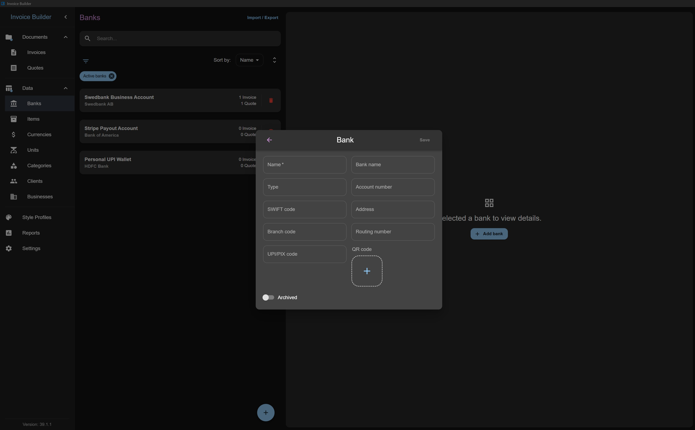
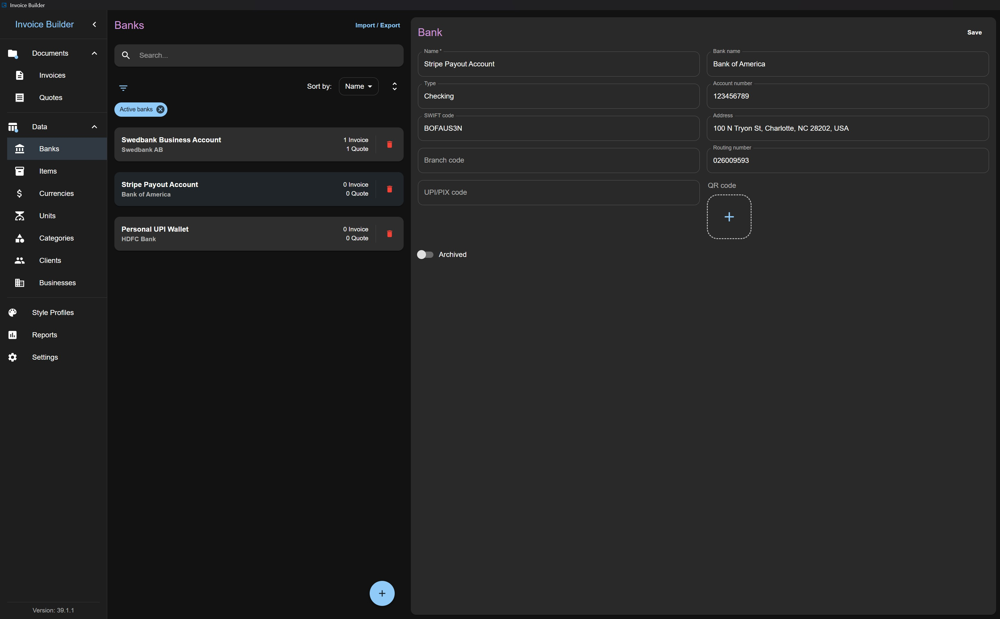
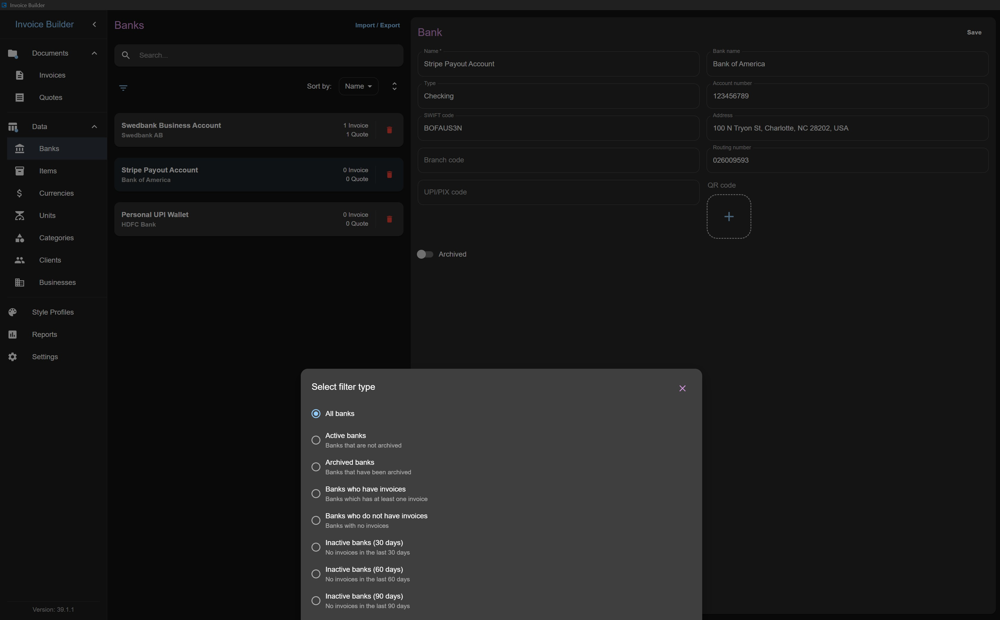
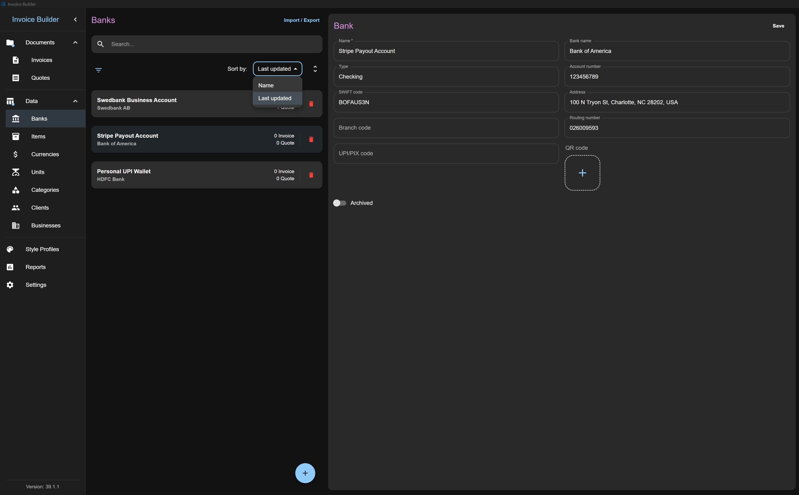
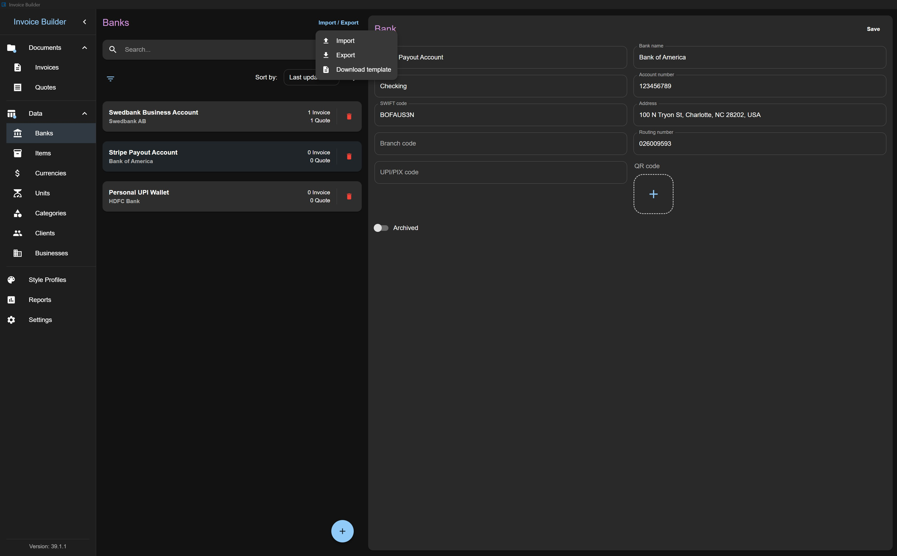

# Banks screen

The **Banks** screen allows you to **create, read, update, and delete (CRUD)** bank data.

You can also:

- **Filter** banks by various criteria
- **Import** and **export** banks via XLSX

:::info
XLSX import/export does **not** include bank QR code data.
:::

This screen follows the shared [Common Screen Patterns](./common-patterns.md) for editing, filtering, sorting, and import/export. Only what's unique to Banks is covered below.

## Adding a Bank

Click the **Add** button at the bottom to open a modal where you can:

- Enter bank information
- Upload a QR code (crop and adjust as needed)

:::warning
Maximum file size: 2 MB
:::

## Editing / deleting a Bank

Each bank item also shows the number of invoices and quotes created with it (quotes count is hidden if the layout is disabled in settings).

## Filters

## Sorting

## Import & Export

