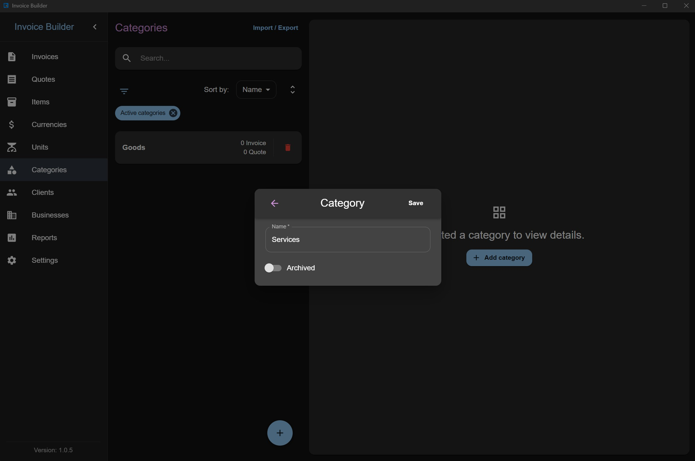
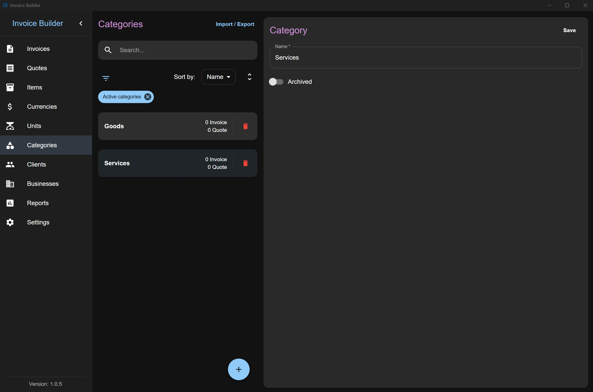
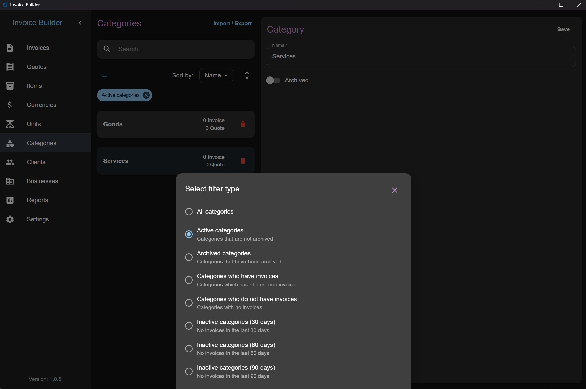
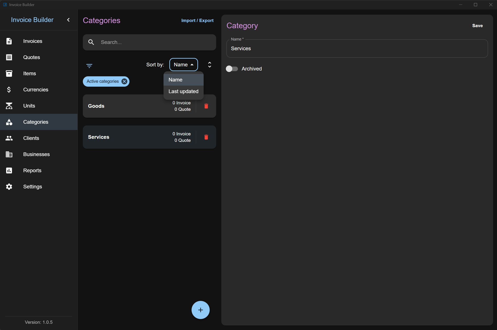
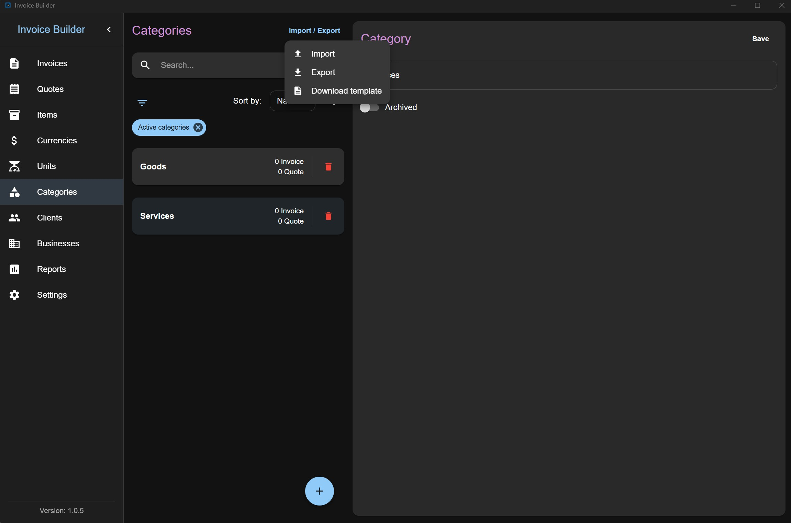

# Categories screen

The **Categories** screen allows you to **create, read, update, and delete (CRUD)** category data. You can also **filter**, **import**, and **export** categories via XLSX.

This screen follows the shared [Common Screen Patterns](./common-patterns.md) for editing, filtering, sorting, and import/export. Only what's unique to Categories is covered below.

## Adding a Category

Click the **Add** button at the bottom to open a modal where you can:

- Enter category information

:::info
Category names must be unique. You cannot create two categories with the same name.
:::

## Editing / deleting a Category

Each category item also shows the number of invoices and quotes created with it (quotes count is hidden if the layout is disabled in settings).

## Filters

## Sorting

## Import & Export

