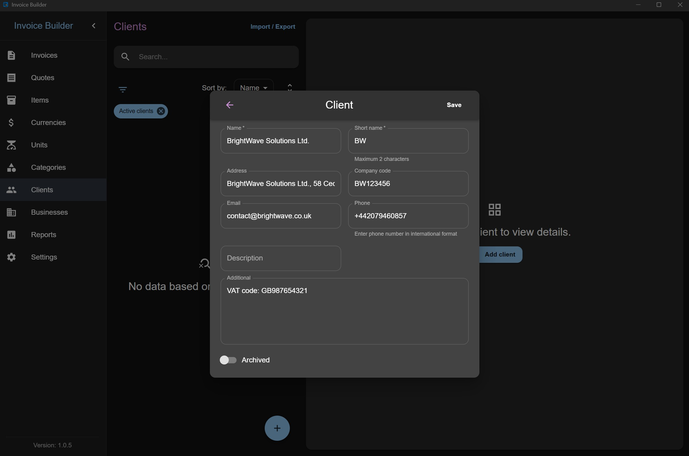
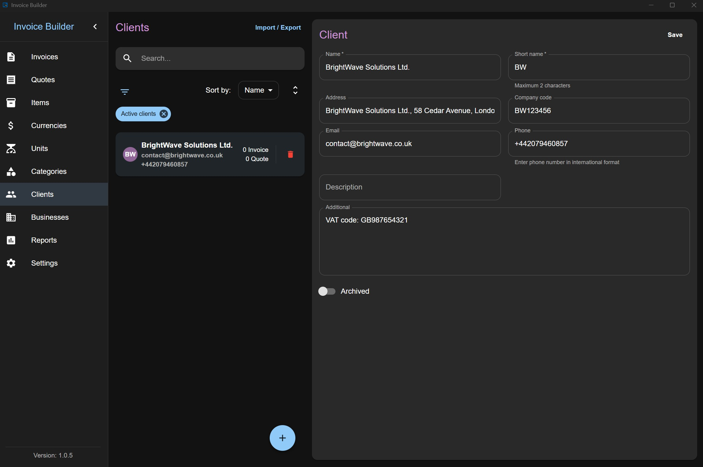
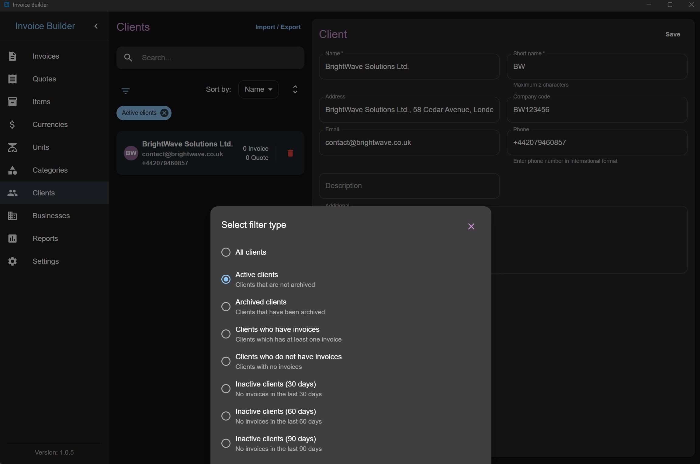
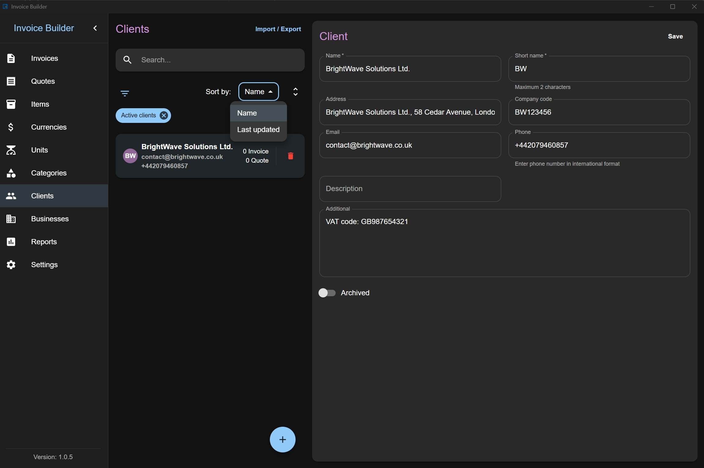
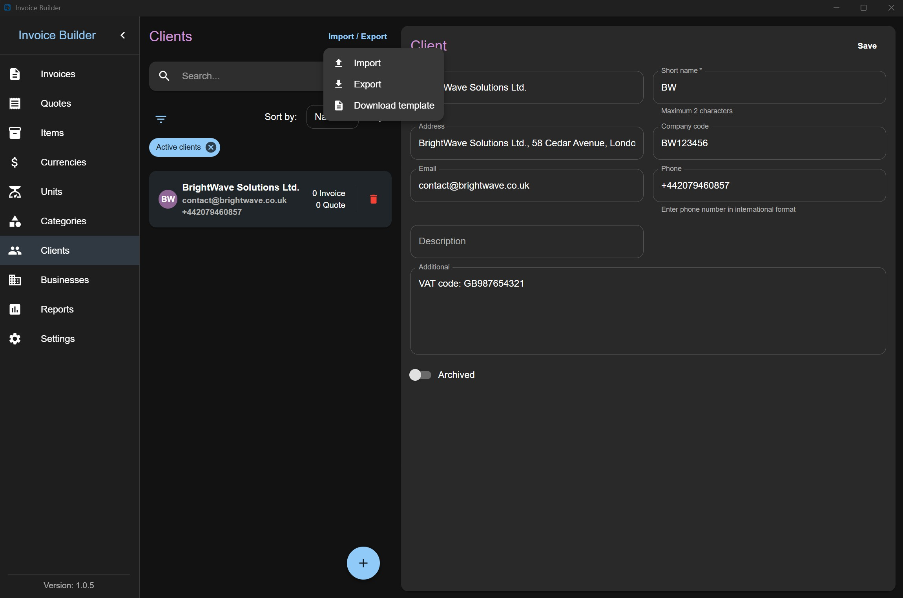

# Clients screen

The **Clients** screen allows you to **create, read, update, and delete (CRUD)** client data. You can also **filter**, **import**, and **export** clients via XLSX.

This screen follows the shared [Common Screen Patterns](./common-patterns.md) for editing, filtering, sorting, and import/export. Only what's unique to Clients is covered below.

## Adding a Client

Click the **Add** button at the bottom to open a modal where you can:

- Enter client information
- When selecting a client from an invoice or quote, use the **Add** action in the client selector to create a client without leaving the document form. Enter a name and, optionally, a phone number. The new client is selected automatically after it is created.

## Editing / deleting a Client

Each client item also shows the number of invoices and quotes created with it (quotes count is hidden if the layout is disabled in settings).

## Filters

## Sorting

## Import & Export

