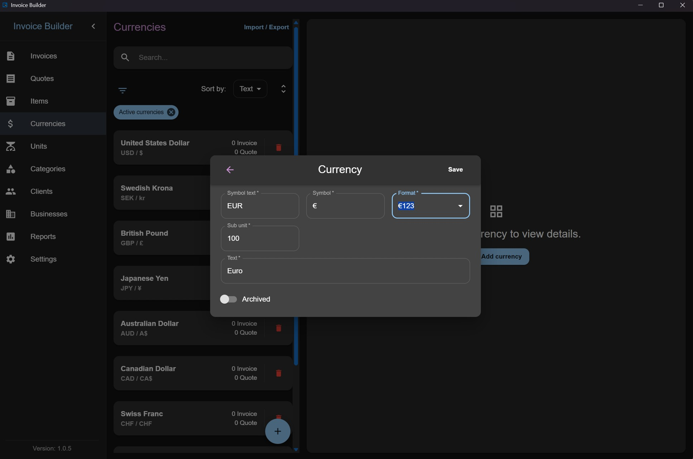
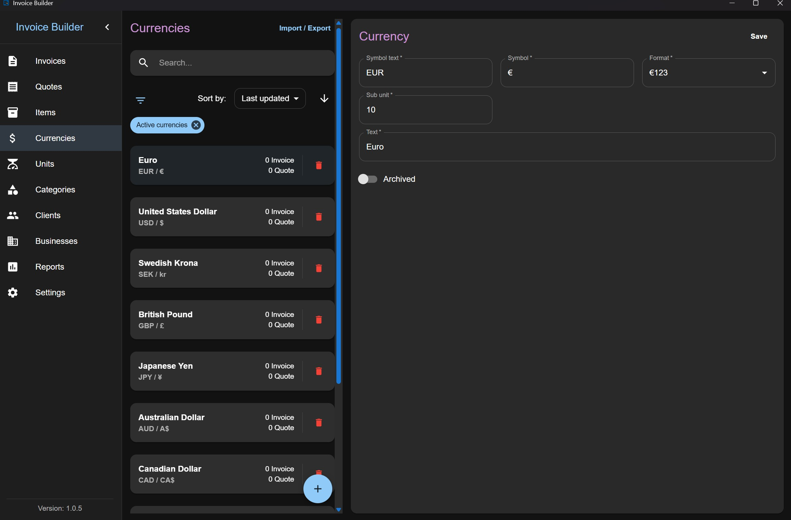
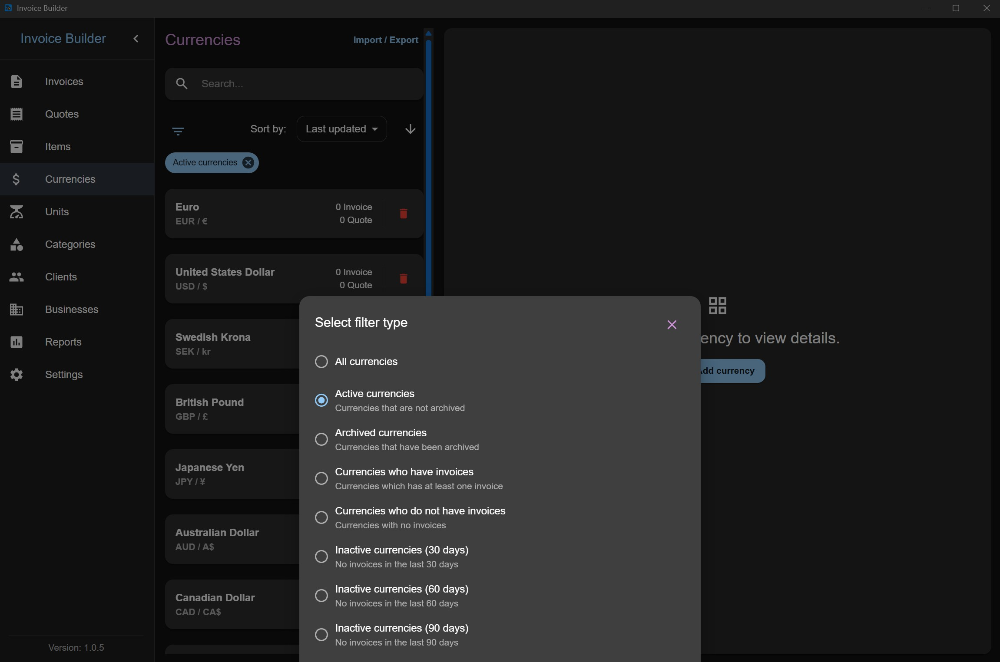
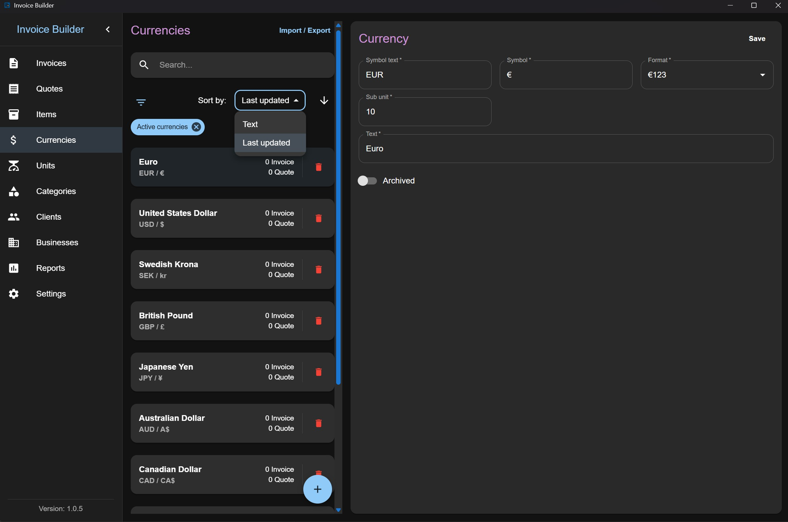
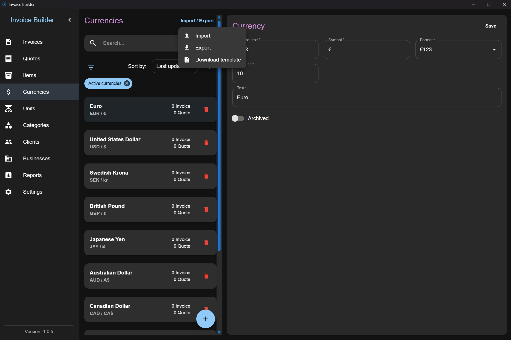

# Currencies screen

The **Currencies** screen allows you to **create, read, update, and delete (CRUD)** currency data. You can also **filter**, **import**, and **export** currencies via XLSX.

This screen follows the shared [Common Screen Patterns](./common-patterns.md) for editing, filtering, sorting, and import/export, with one difference: currencies are searched and sorted by **text** instead of name. Only what's unique to Currencies is covered below.

## Adding a Currency

Click the **Add** button at the bottom to open a modal where you can:

- Enter currency information

:::info
**Note:** Currency symbols must be unique. You cannot create two currencies with the same symbol.

**Subunit:** Defines how many subunits make up one unit of the currency. For example:

- USD and EUR: 100 subunits = 1 USD/EUR
- Japanese Yen (JPY): 1 subunit = 1 JPY

:::

## Editing / deleting a Currency

Each currency item also shows the number of invoices and quotes created with it (quotes count is hidden if the layout is disabled in settings). You can search currencies by text.

## Filters

## Sorting

Currencies can be sorted by:

- Text
- Last updated date

## Import & Export

