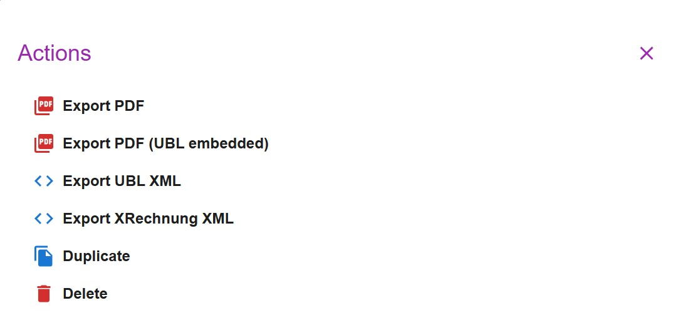
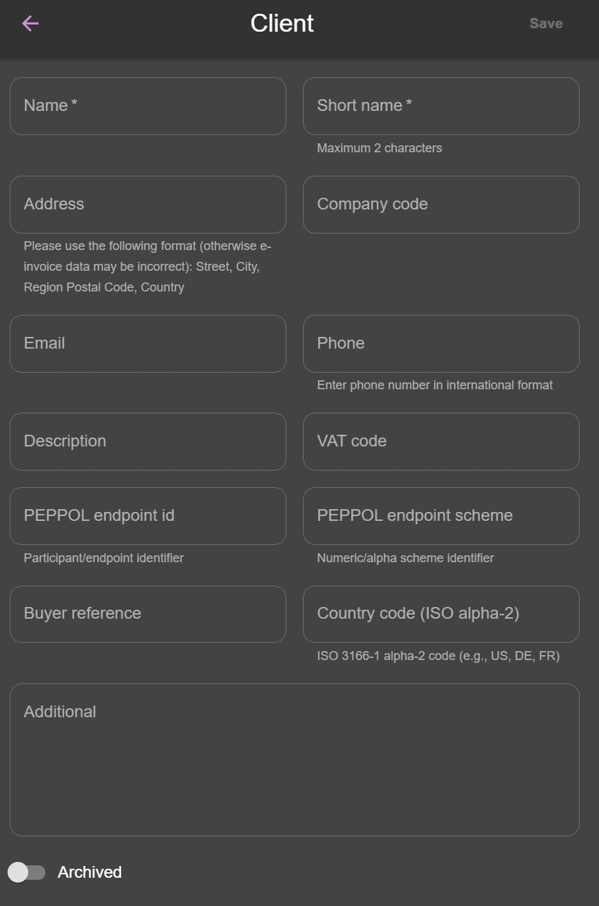
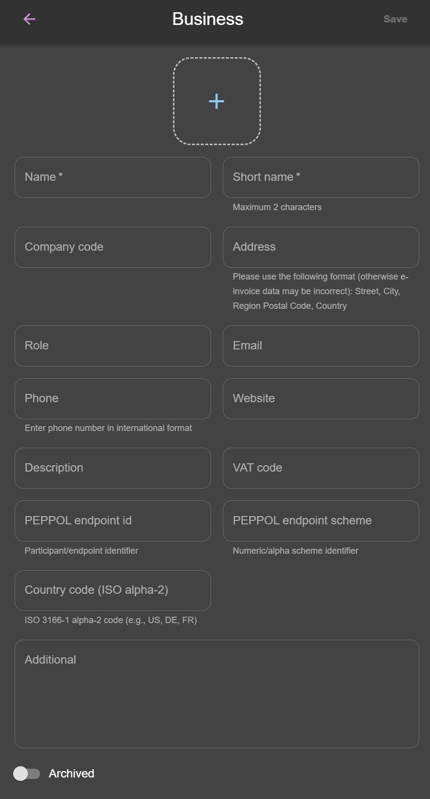

# e-invoices

The application supports:

- UBL Peppol XML: you can download the XML embedded with the PDF, or as a standalone XML file. This feature is enabled by default and can be toggled in the Settings page.
- XRechnung (UBL 2.1) XML: you can download the standalone XML file. This feature is enabled by default and can be toggled in the Settings page.

To generate valid UBL/Peppol XML or XRechnung (UBL 2.1) XML, additional fields are available on [Businesses](./businesses.md) and [Clients](./clients.md). These fields must be properly filled to produce compliant invoices.

:::info[UBL XML / XRechnung XML may fail validation if data is misconfigured]
The application only checks that required fields are present. It does not guarantee that all values conform to UBL/Peppol or XRechnung (UBL 2.1) standards.

For example:

- Tax names must match supported values (e.g., VAT). Arbitrary text will cause validation errors.
- Currency codes must be standard ISO codes (e.g., EUR, USD). Random text will fail validation.

Export behavior:

- A regular PDF can be exported at any time.
- The XML file and the PDF with embedded XML reflect only saved data.
- You cannot export XML while creating a new invoice until it has been saved.
- When editing an invoice, make sure to save changes before exporting.

Use a UBL Peppol XML validator (e.g., [https://peppolvalidator.com/](https://peppolvalidator.com/)) to ensure compliance before sending.
Use a XRechnung (UBL 2.1) XML validator (e.g., [https://validator.invoice-portal.de/](https://validator.invoice-portal.de/)) to ensure compliance before sending.
:::
