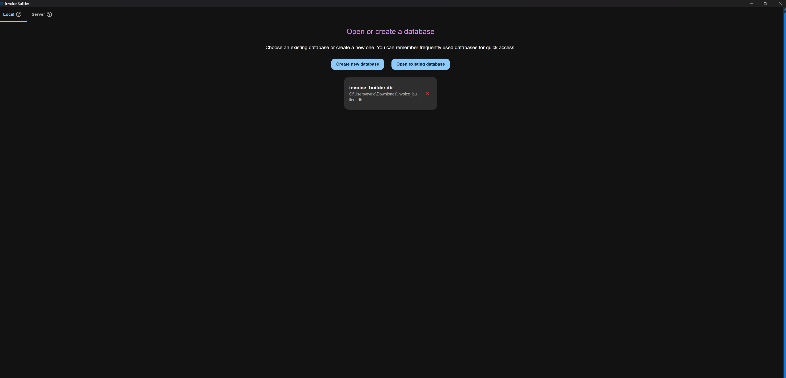
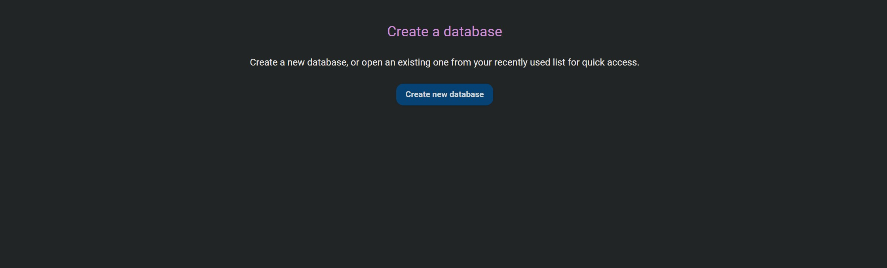
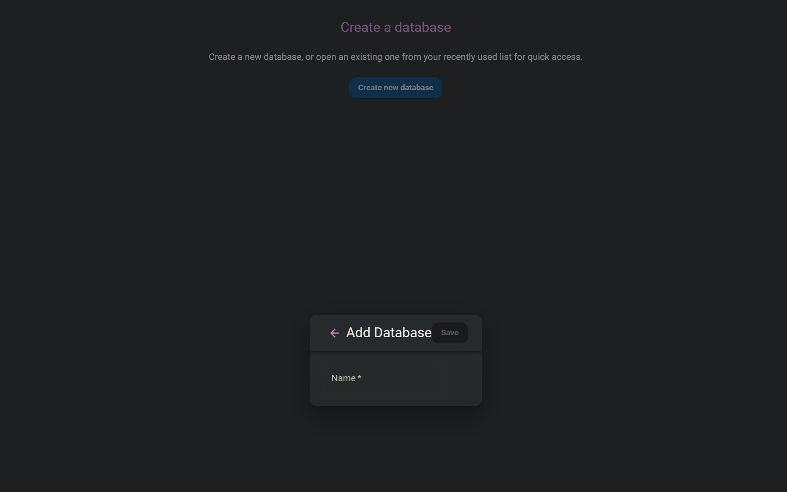
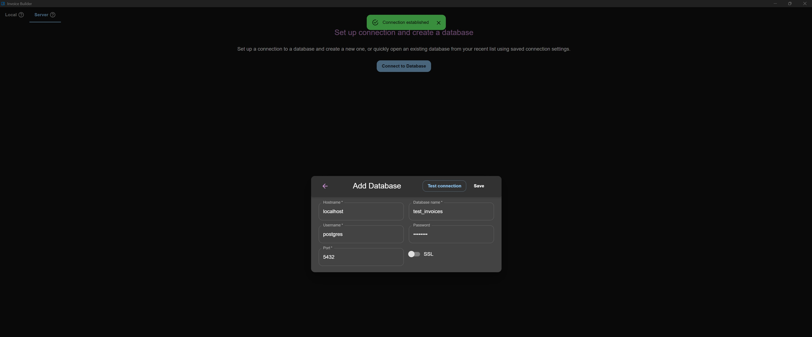
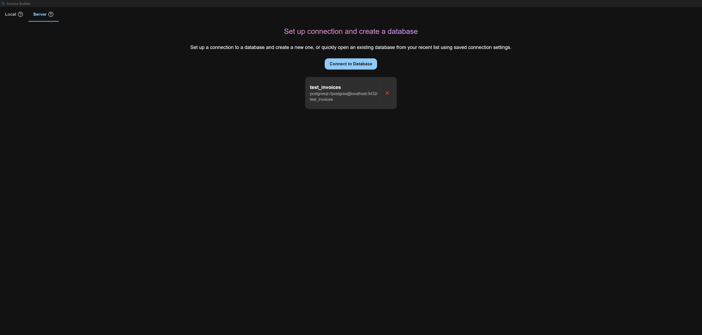
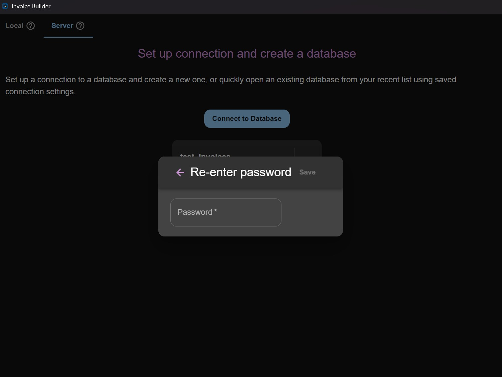

# Getting Started

## Database creation screen

The first screen of the application lets you choose how you want to work with your database.
You can either create/open a local database file or connect to a database server.

### Local database

Recently opened databases are displayed in a **quick access list** for faster reopening.

When the application runs in Docker or the web version, databases are created inside a predefined folder. All databases in that folder are automatically listed in Quick Access.
To remove a database from the Quick Access list, simply delete it from that folder.
During creation, you will be prompted to enter the database name.

### Server database

Recently used server connections also appear in a Quick Access list for faster reconnecting.
For security reasons, passwords are never saved, so you will always need to re-enter the password when reconnecting.
On the connection screen, you can:

- Enter server connection details
- Test the connection
- Save the connection (without password) for quick access

### Switching databases

You don't need to restart the application to switch to a different database. Use the **Log out** option at the bottom of the sidebar menu to return to this database creation screen, where you can open or create another local database or connect to a different server.
