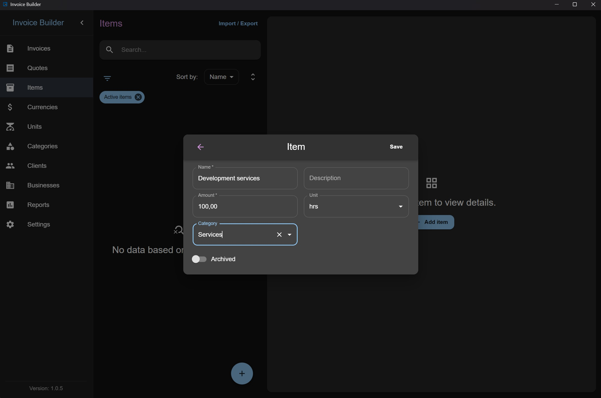
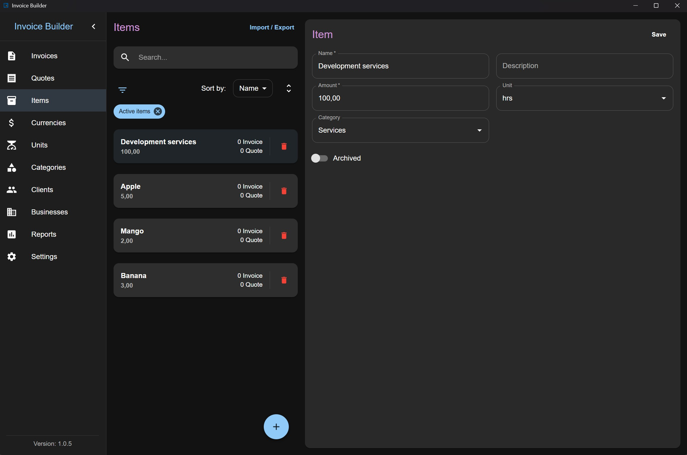
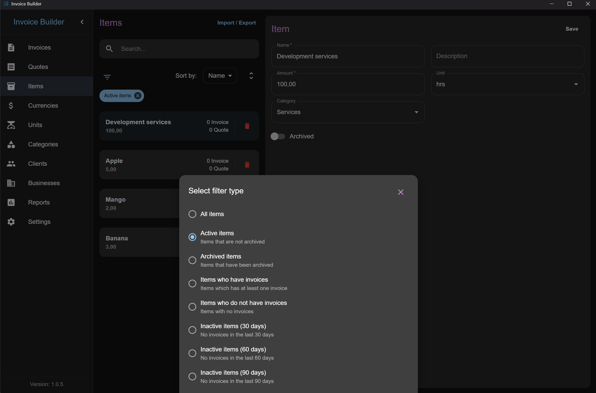
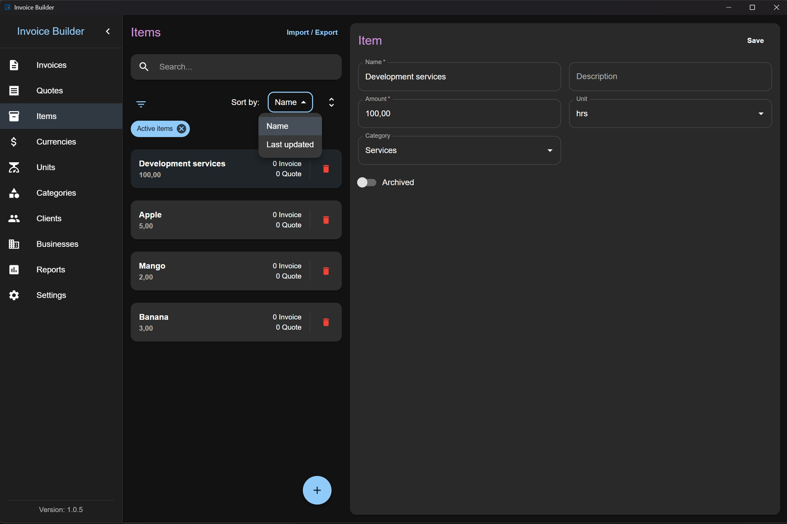
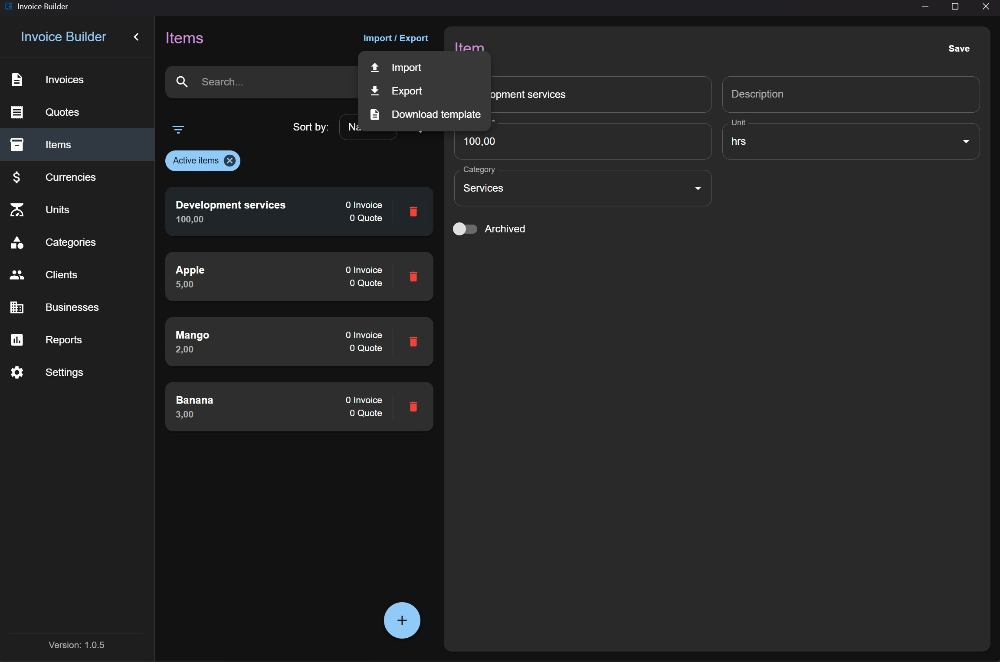

# Items screen

The **Items** screen allows you to **create, read, update, and delete (CRUD)** item data. You can also **filter**, **import**, and **export** items via XLSX.

This screen follows the shared [Common Screen Patterns](./common-patterns.md) for editing, filtering, sorting, and import/export. Only what's unique to Items is covered below.

## Adding an Item

Click the **Add** button at the bottom to open a modal where you can:

- Enter item information

:::info
The item amount is always recorded in the selected currency. The currency is attached once when the item is added to a quote or invoice. Changing the quote/invoice currency will **not** automatically convert existing item amounts.
:::

## Editing / deleting an Item

Each item also shows the number of invoices and quotes created with it (quotes count is hidden if the layout is disabled in settings).

## Filters

## Sorting

## Import & Export

:::info
When importing items from XLSX, if a unit or category name is provided and does not already exist in the system, it will be automatically created.
:::

