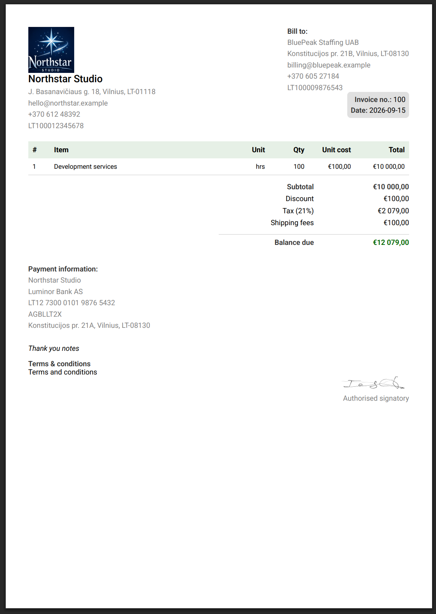
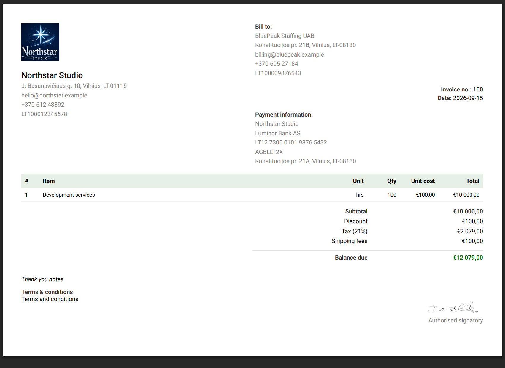
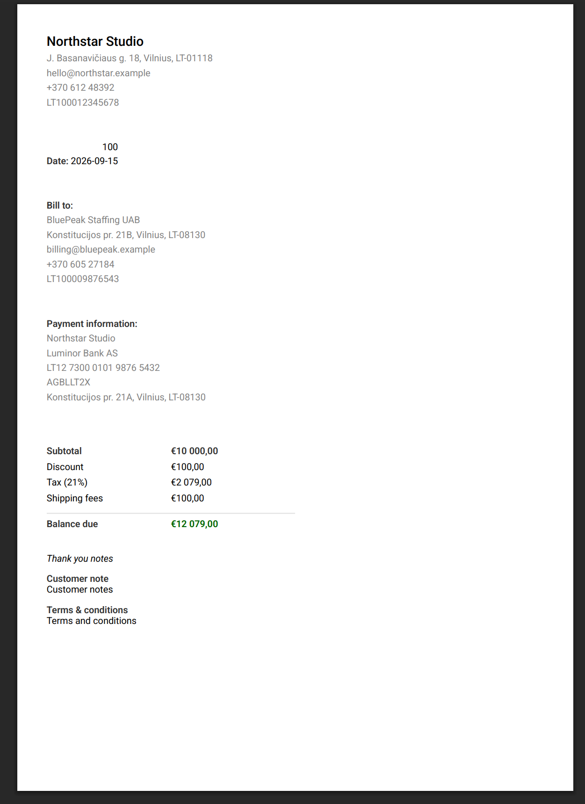
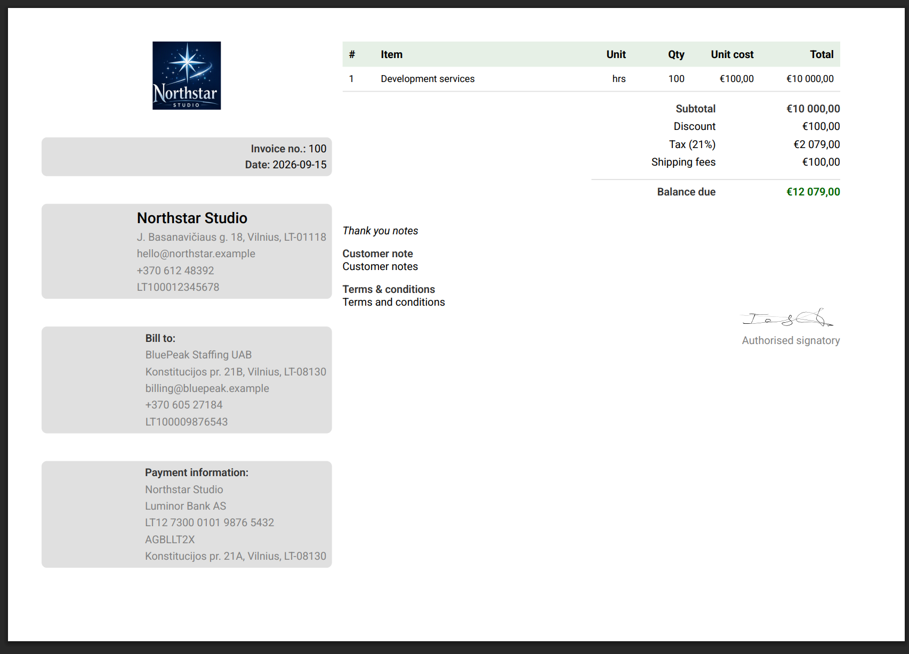

Invoice Builder includes ready-made V2 layout schemas that can be imported through the **Layouts** screen.

- [Compact invoice](https://github.com/piratuks/invoice-builder/blob/main/docs/guides/examples/v2-compact-invoice.json)

  

- [Nested header rows](https://github.com/piratuks/invoice-builder/blob/main/docs/guides/examples/v2-nested-header-rows.json)

  

- [Receipt summary](https://github.com/piratuks/invoice-builder/blob/main/docs/guides/examples/v2-receipt-summary.json)

  

- [Sidebar landscape](https://github.com/piratuks/invoice-builder/blob/main/docs/guides/examples/v2-sidebar-landscape.json)

  

See [Invoice Layout JSON](./layout-json.md) for the complete schema reference and import workflow.
