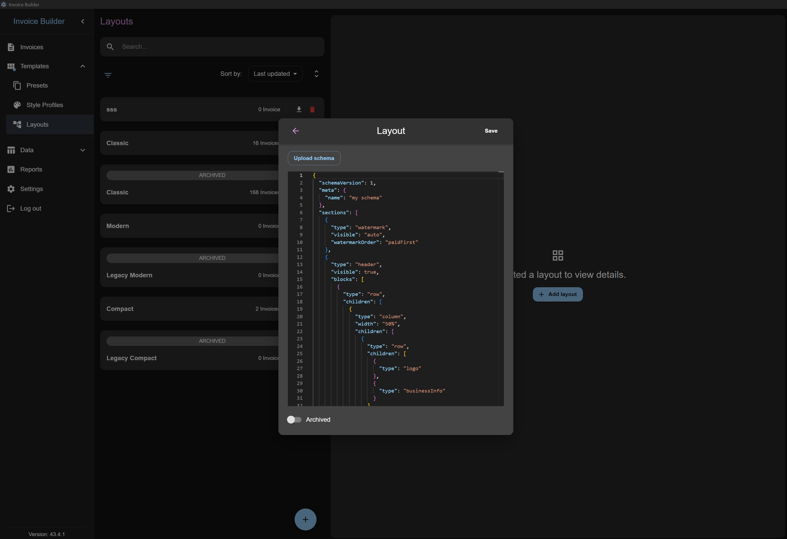
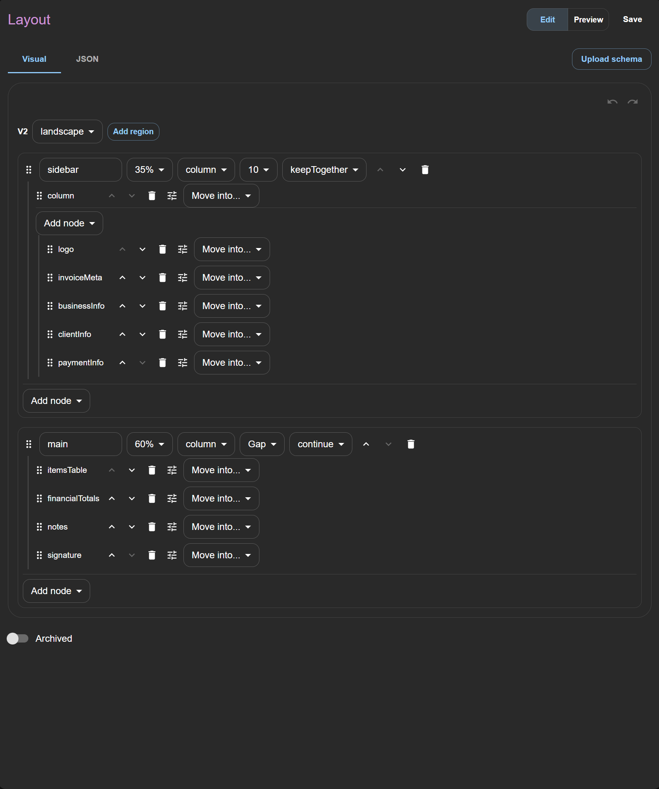
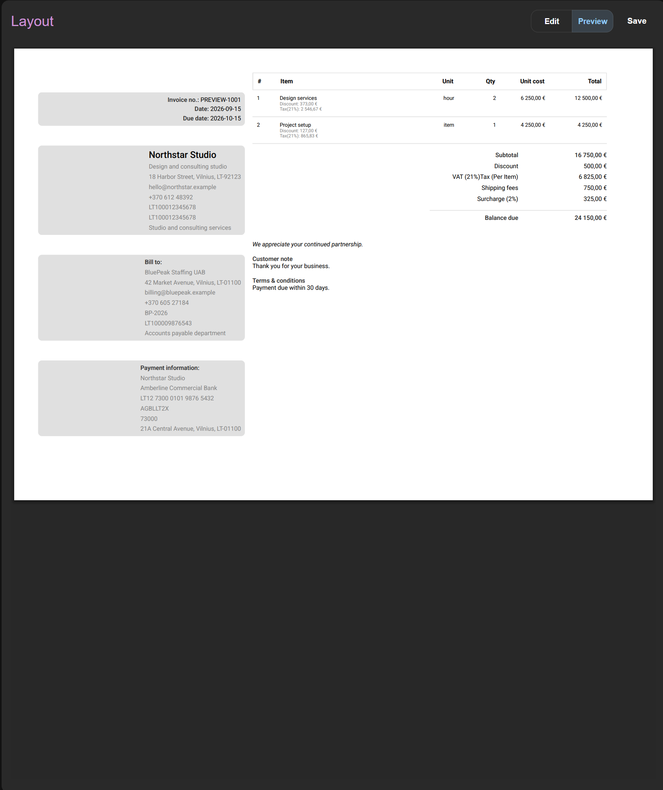
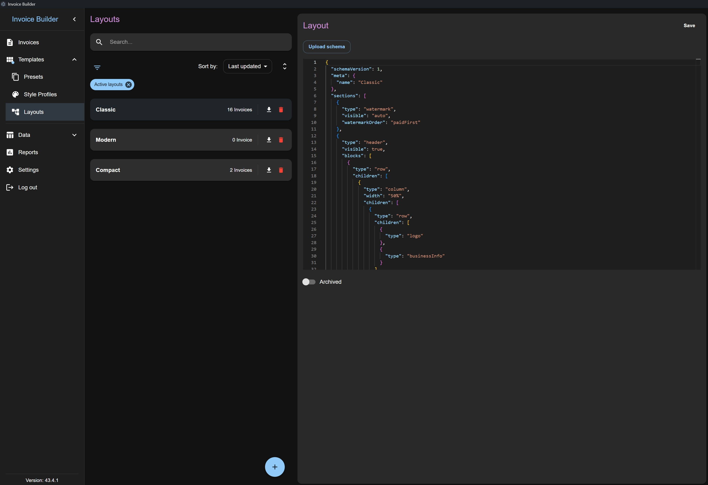
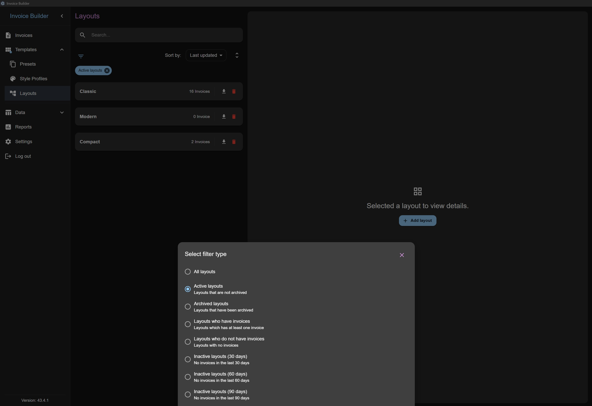
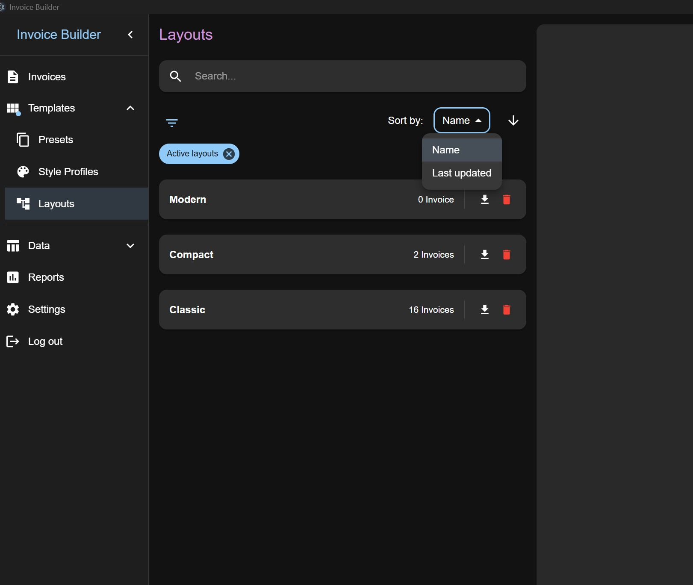
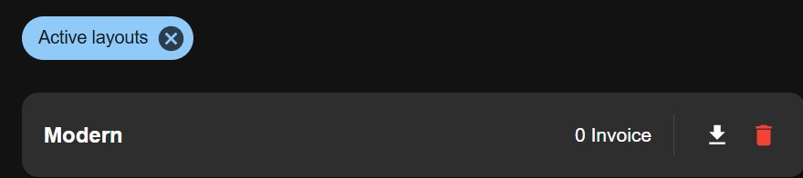
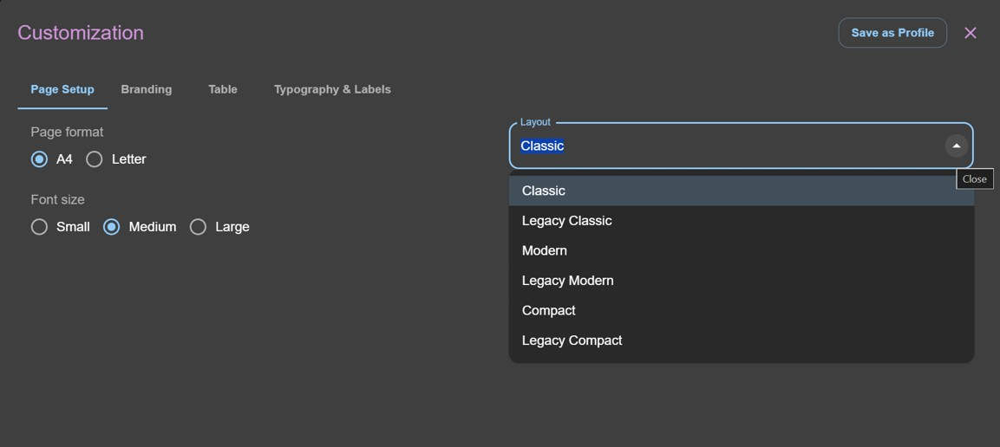
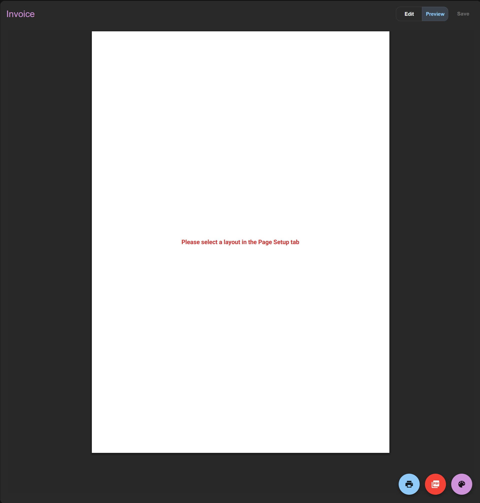

# Layouts screen

The **Layouts** screen allows you to **create, read, update, and delete (CRUD)** the JSON structures used to compose invoice and quote PDFs. Layouts control document structure, while colors, fonts, labels, table styling, and page settings remain configured in the invoice or quote customization options.

Layouts support two schema versions:

- **V1**: ordered invoice sections with nested header rows and columns.
- **V2**: customizable page-level JSON composition with independent regions, sidebars, landscape orientation, recursive rows/columns/grids, configured sections, and controlled region overflow.

V2 layout schemas continue to use the application's whitelisted content blocks and sections. They do not contain React, JavaScript, HTML, CSS, custom fonts, or arbitrary executable content. See [Layout JSON reference](./layout-json.md) for V1 and V2 examples and validation rules.

Layout records can be archived and selected from invoice or quote page setup. Existing invoices and quotes keep a snapshot of the layout used when they were saved, so later layout changes do not alter historical documents.

## Adding a Layout

Click **Add** to create a new layout. The **Visual** tab is the default editing mode. Use its controls to add sections, header blocks, regions, rows, columns, and grids, then reorder or reparent them with buttons, menus, keyboard actions, or drag and drop.

You can also use **Upload schema** to import a valid V1 or V2 JSON layout. The JSON must contain a layout name and use the supported schema version and properties documented in the [Layout JSON reference](./layout-json.md). Ready-made examples are available in [`layouts`](./layout-json-examples.md).

## Editing / deleting a Layout

Select a layout from the list to edit it visually. The **JSON** tab is a read-only inspection view of the generated schema; use **Upload schema** to replace it with a validated JSON layout.

Use the **Preview** mode to see a representative invoice rendered through the same PDF interpreter used for invoice and quote output. Layout edits support undo and redo, and the builder warns when V2 nesting or node-count limits are reached.

The upload is checked before it is applied. Invalid JSON, unsupported properties, duplicate sections, and unsupported values are rejected with validation errors. Layout JSON files are limited to 64 KB.

You can also:

- **Search layouts by name**
- **Delete a layout** by clicking the red trash icon

## Filters

Layouts have filters to control what is displayed. By default:

- **Active**: shows all layouts except archived

The **archived flag** can be toggled during creation or editing. This flag only affects filtering and does not delete the layout.

## Sorting

Layouts can be sorted by:

- Schema name
- Last updated date

## Export

You can export a saved layout as a `.json` file for reuse or transfer to another compatible database.

Layout JSON export is available from the download icon on each layout in the list. Layouts are exported individually, not as an XLSX file.

## Selecting a Layout

In an invoice or quote, open page setup and select an active, non-archived layout. The selected layout determines the order and composition of the PDF sections, including the header, items table, totals, payment information, notes, signature, watermark, and page counter.

For the complete JSON structure, supported sections, header blocks, composition examples, and limitations, see the [Layout JSON reference](./layout-json.md).
