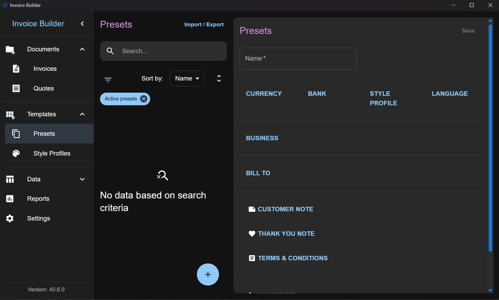
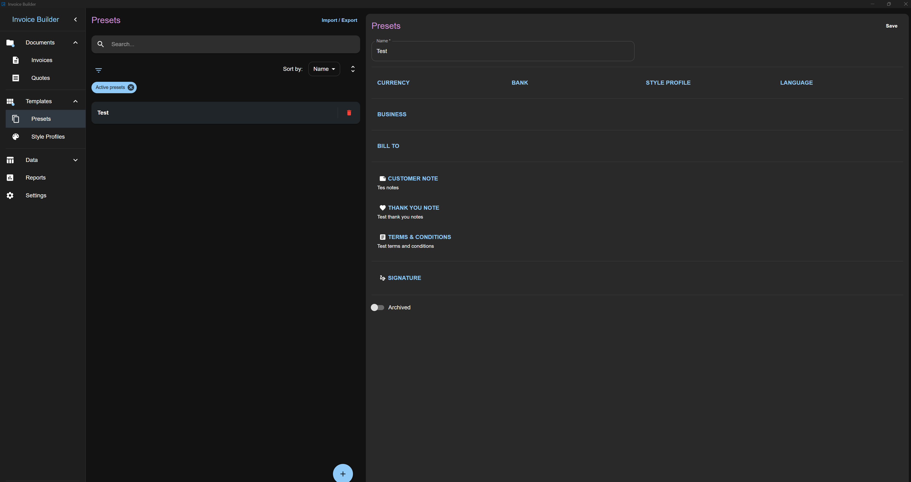
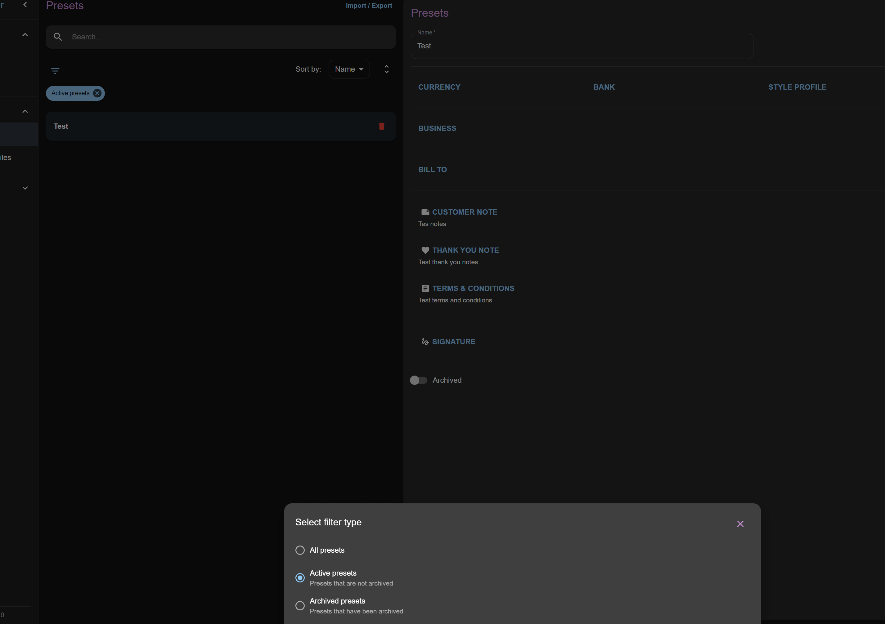
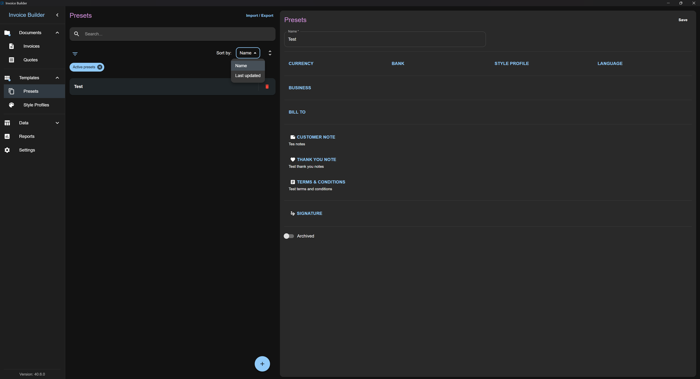
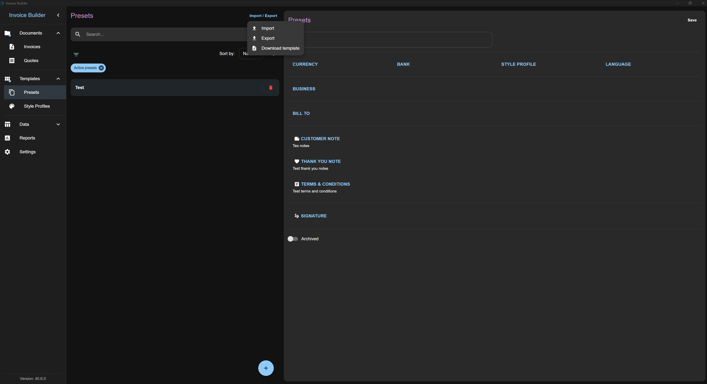

# Presets screen

The **Presets** screen allows you to **create, read, update, and delete (CRUD)** preset data.

You can also:

- **Filter** presets by various criteria
- **Import** and **export** presets via XLSX

This screen follows the shared [Common Screen Patterns](./common-patterns.md) for editing, filtering, sorting, and import/export. Only what's unique to Presets is covered below.

## Adding a Preset

Click the **Add** button at the bottom to open a modal where you can:

- Enter preset information

## Editing / deleting a Preset

Once presets are added, select one from the list to edit it on the right side.

## Filters

## Sorting

## Import & Export

