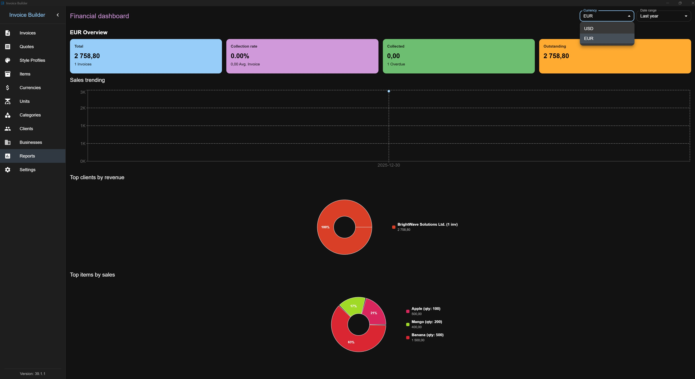
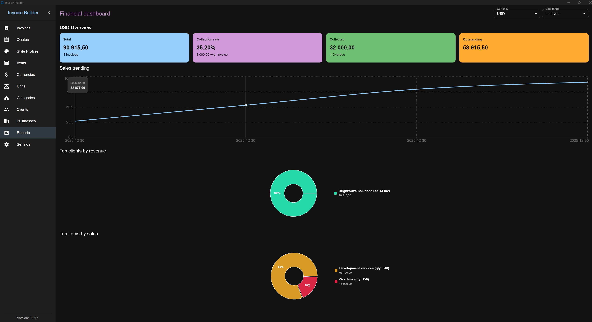
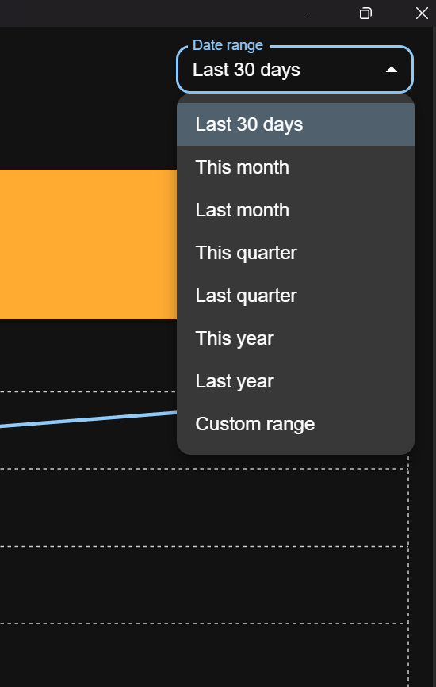
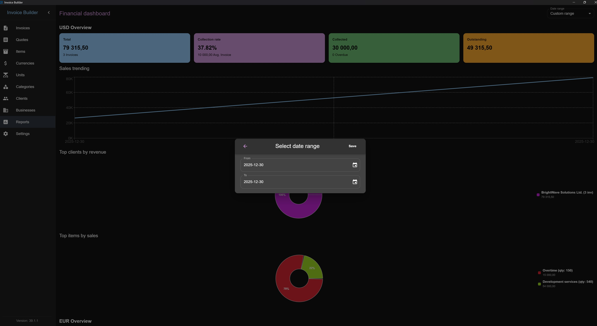

# Reports screen

The **Reports** screen provides an overview of **aggregated financial data grouped by currency** for a selected period. It can be chosen to take into account either the issued date or the paid date for reporting.

## Filters

You can filter reports using:

- **Predefined periods** (e.g. this month, last year)
- **Custom date ranges**

