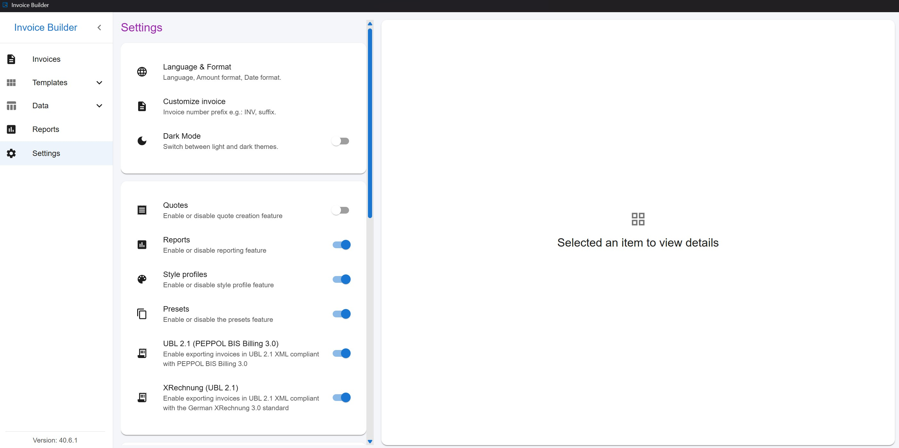
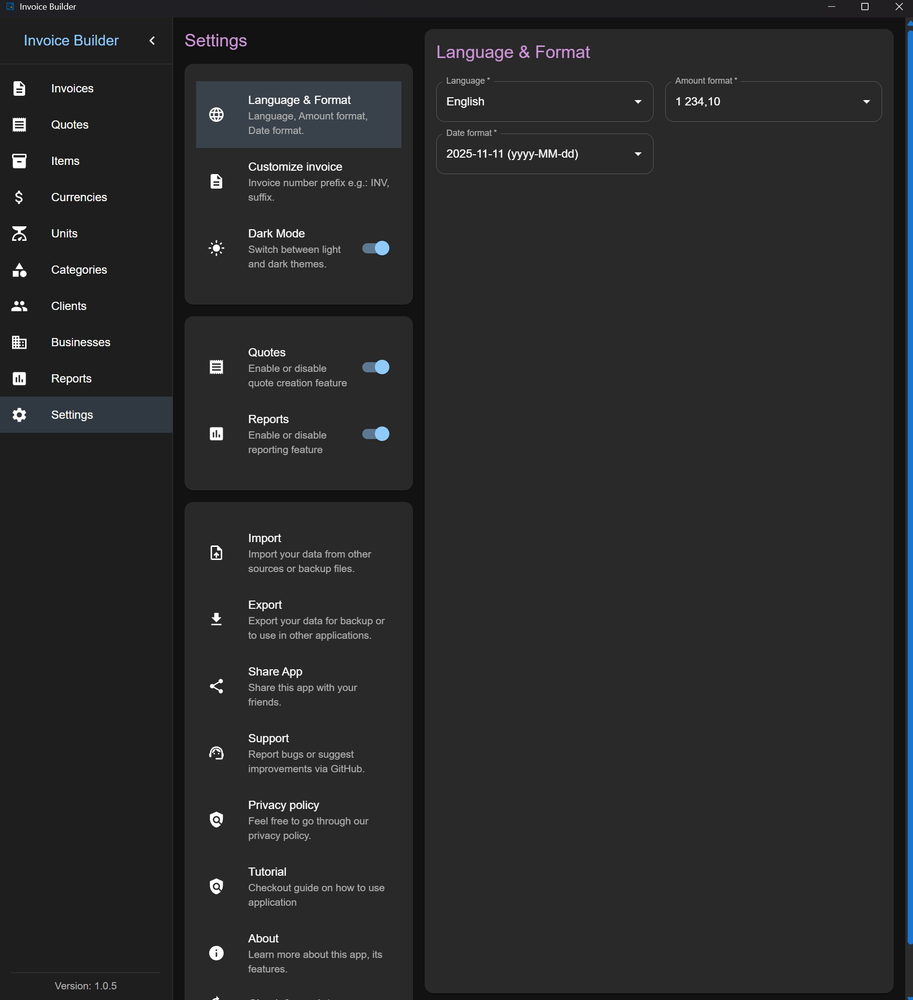
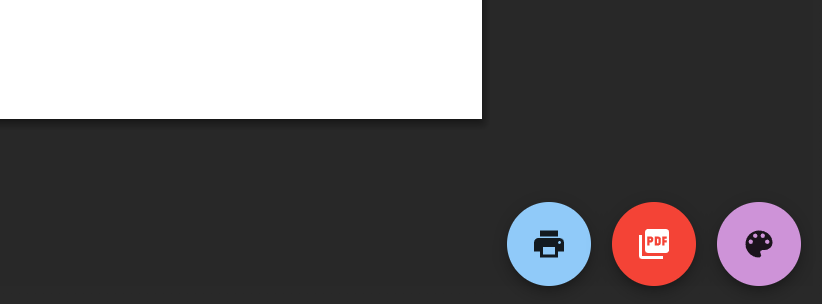
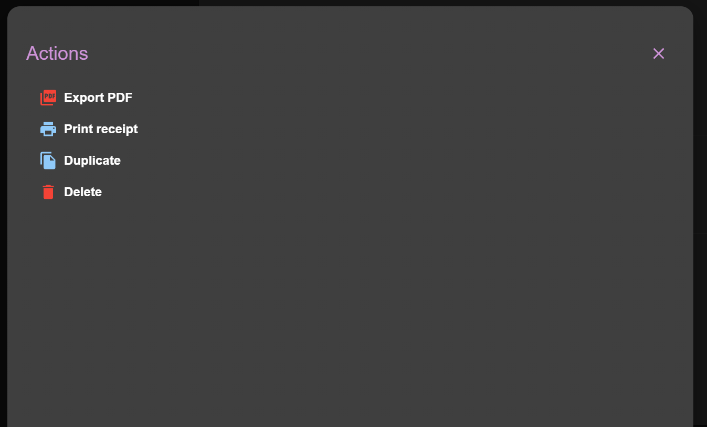
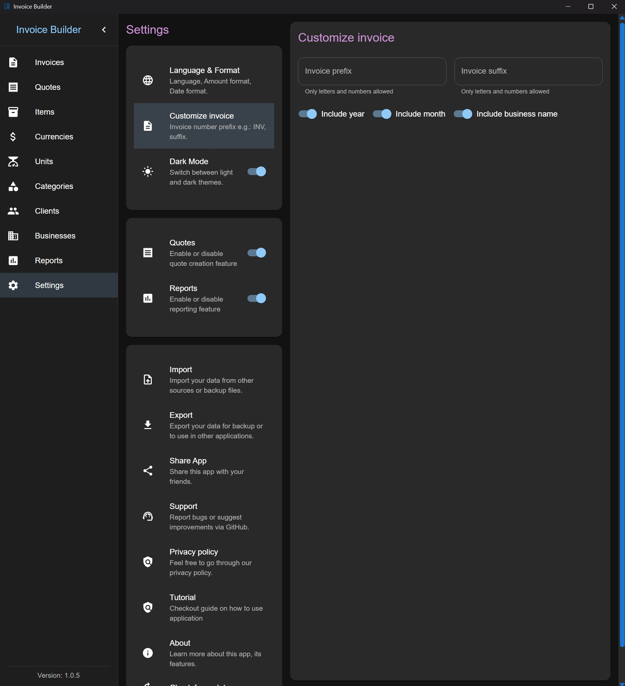

# Settings screen

The **Settings** screen allows you to configure application behavior, manage data, and customize document output.

## General & Data Management

From this screen you can:

- Enable or disable optional features (**Presets**, **Style profiles**, **Quotes** and **Reports**)
- Enable or disable optional features (**UBL 2.1**, **XRechnung**, **Receipt Printing**)
- Export all application data to **JSON**
- Import previously exported data
- Access project resources:
  - GitHub repository
  - Issue tracker
  - Tutorial
  - Project homepage
  - Privacy Policy
  - Terms of Use
- Check for application updates via GitHub Releases (Available only for native software version)

## Localization & Formatting

You can customize:

- Application language
- Number (amount) formatting
- Date formatting

## Receipt printing

Receipt printing produces a compact 80mm receipt layout for invoices, designed for retail checkout and POS-style workflows. It is available in both the desktop Electron app and the web/Docker version, but the two work differently:

| Mode                   | How it works                                                                                                          | Output                                                                                                                                              |
| ---------------------- | --------------------------------------------------------------------------------------------------------------------- | --------------------------------------------------------------------------------------------------------------------------------------------------- |
| **Desktop (Electron)** | Uses the operating system's native print dialog. A compatible printer must be installed and selected before printing. | Physical printout (e.g. on an 80mm thermal receipt printer), no browser chrome, no header/footer.                                                   |
| **Web / Docker**       | Opens the receipt in a new browser tab and triggers the browser's own print dialog.                                   | Any destination the browser offers, including **"Save as PDF"** to get a receipt PDF, since there is no OS-level print API available to a web page. |

:::info
In web/Docker mode, the browser's print dialog may add its own header/footer (page URL, date, page count). This is a browser preference, not something the app can turn off by default - uncheck **"Headers and footers"** under **More settings** in the print dialog for a cleaner printout; the browser remembers this choice for future prints.
:::

## Invoice & File Naming

The following options are available:

- Customize invoice and quote numbers using:
  - Prefix
  - Suffix
- Customize exported PDF file names

When a numeric invoice number uses leading zeros (for example, 000005), the next auto-generated number keeps the same width (000006, 000007, ...), expanding only when required (for example, 999999 -> 1000000).

By default, files are named: "{Invoice|Quote}\_{InvoiceNumber}.pdf"

You can optionally include:

- Year
- Month
- Business name

