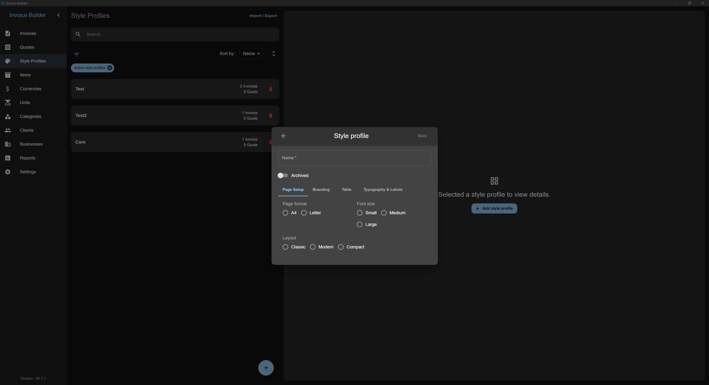
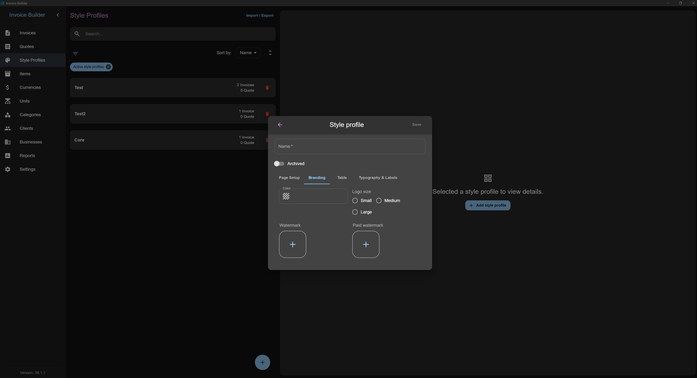
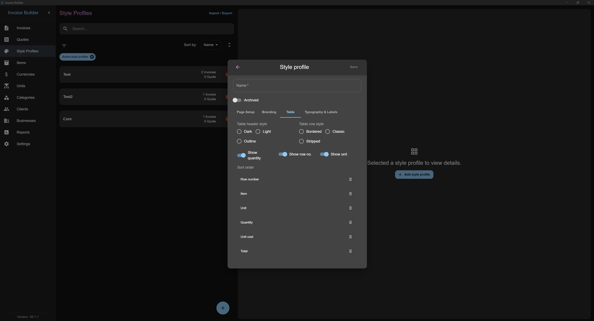
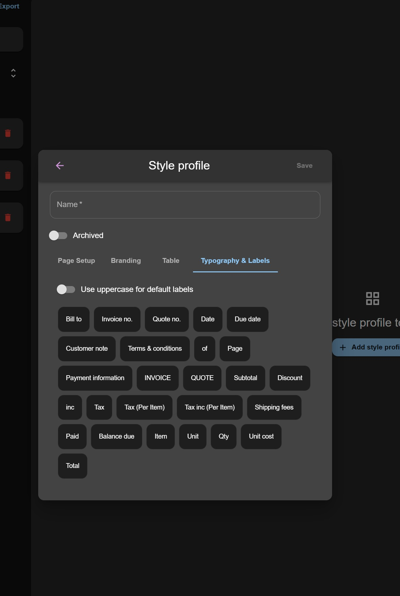
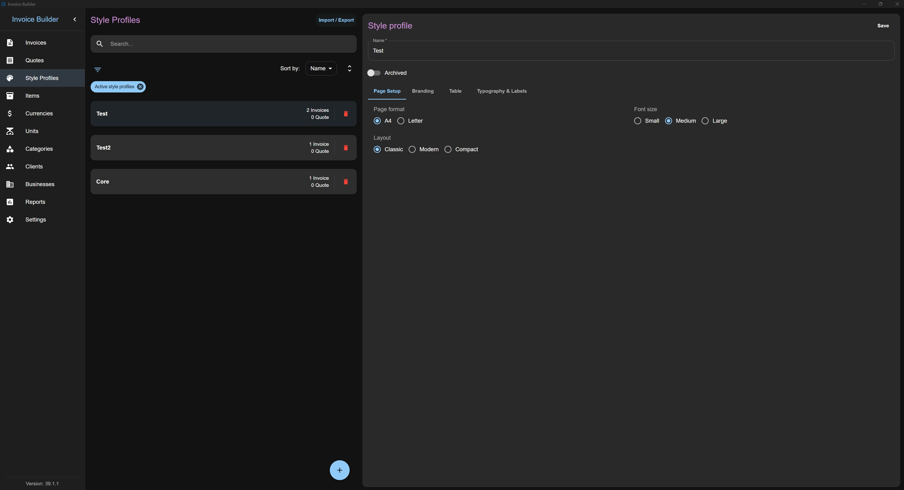
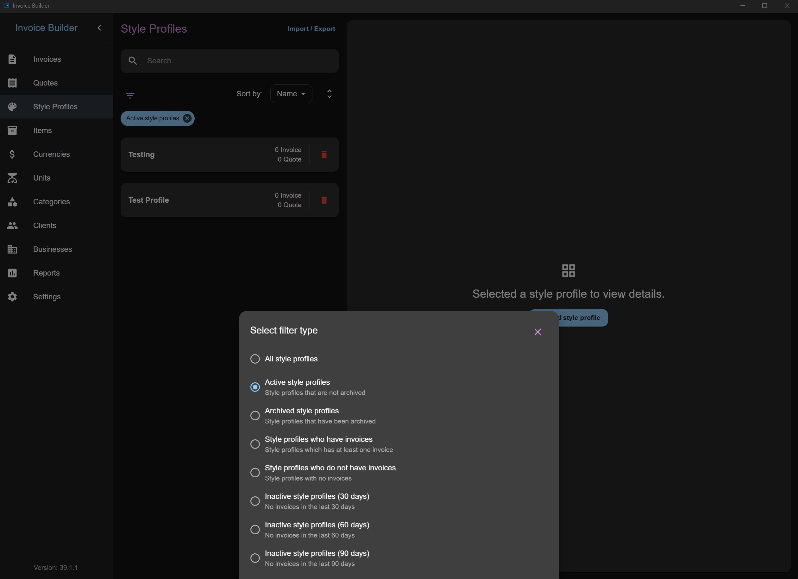
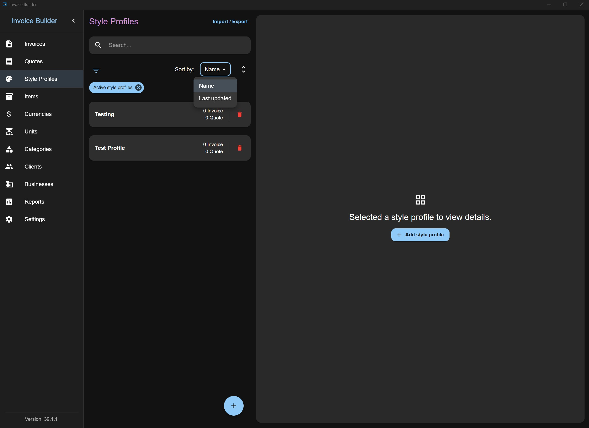
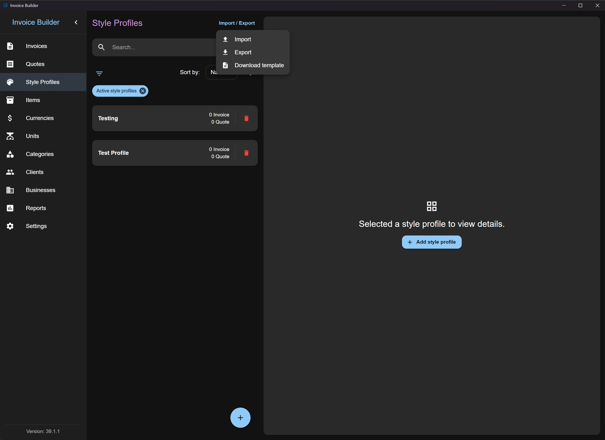

# Style profiles screen

The **Style profiles** screen allows you to **create, read, update, and delete (CRUD)** style profile data, which can later be used in [Invoices](./invoices.md) and [Quotes](./quotes.md). You can also **filter**, **import**, and **export** style profiles via XLSX.

This screen follows the shared [Common Screen Patterns](./common-patterns.md) for editing, filtering, sorting, and import/export. Only what's unique to Style profiles is covered below.

## Adding a Style profile

Click the **Add** button at the bottom to open a modal where you can:

- Enter style profile information

:::info
**Name:** must be unique. You cannot create two style profiles with the same name.

**Sort Order:** under the "Table" tab it's possible to customize the sort order of generic item table headers.
:::

## Editing / deleting a Style profile

Each style profile item also shows the number of invoices and quotes created with it (quotes count is hidden if the layout is disabled in settings).

## Filters

## Sorting

## Import & Export

