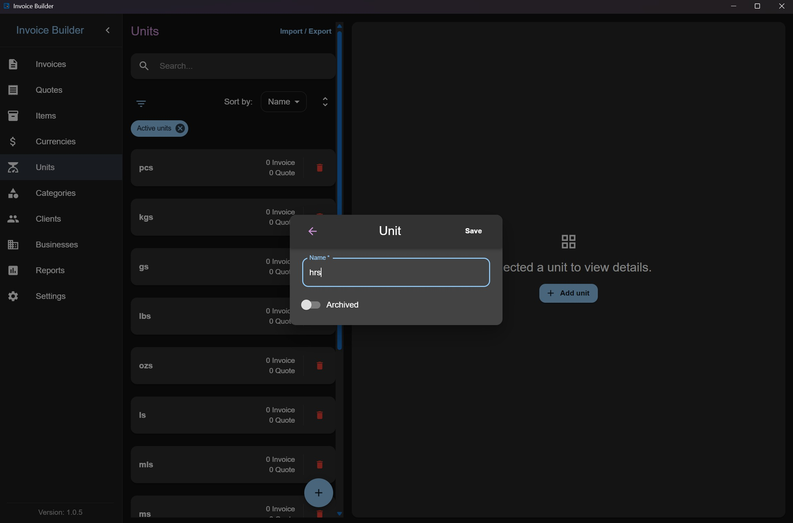
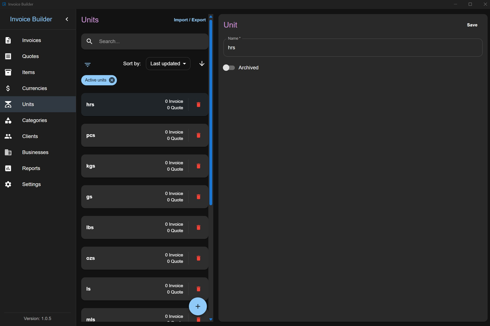
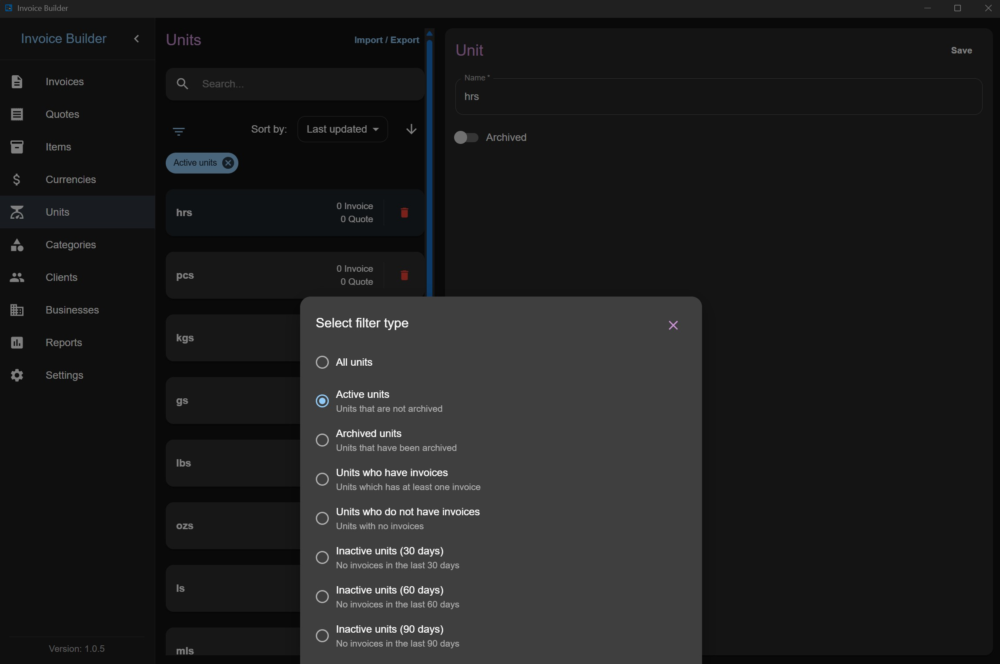
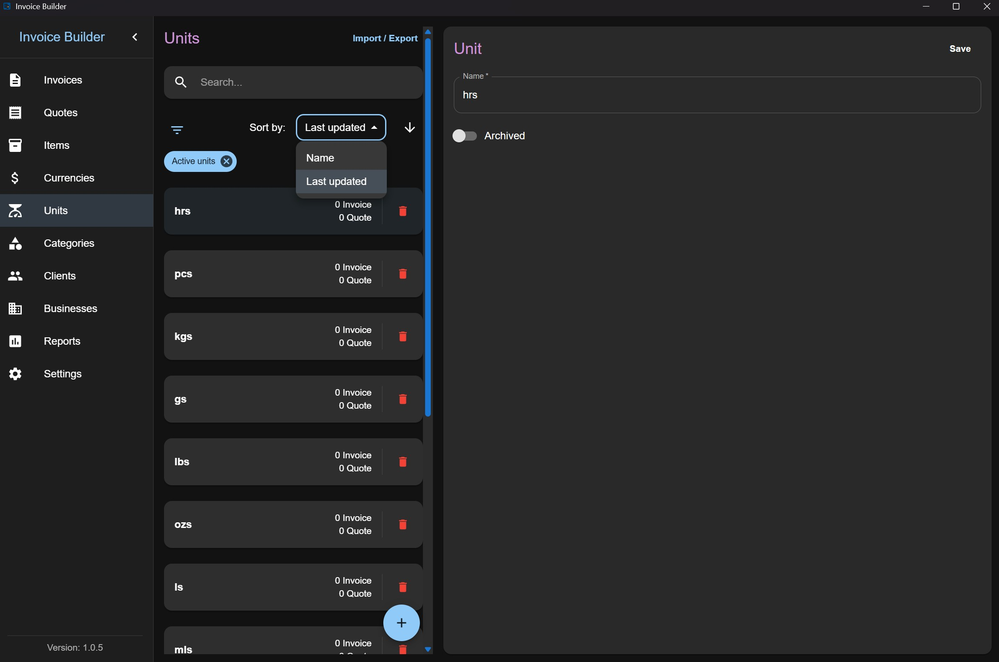
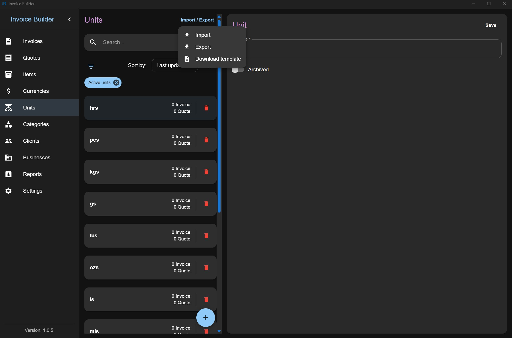

# Units screen

The **Units** screen allows you to **create, read, update, and delete (CRUD)** unit data. You can also **filter**, **import**, and **export** units via XLSX.

This screen follows the shared [Common Screen Patterns](./common-patterns.md) for editing, filtering, sorting, and import/export. Only what's unique to Units is covered below.

## Adding a Unit

Click the **Add** button at the bottom to open a modal where you can:

- Enter unit information

:::info
Unit names must be unique. You cannot create two units with the same name.
:::

## Editing / deleting a Unit

Each unit item also shows the number of invoices and quotes created with it (quotes count is hidden if the layout is disabled in settings).

## Filters

## Sorting

## Import & Export

